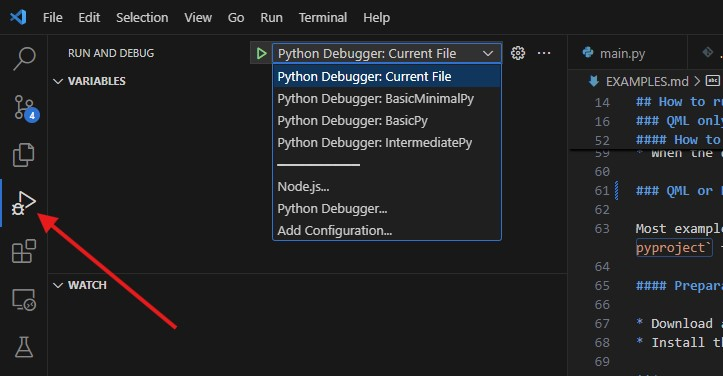

## Types of examples

Different types of examples are provided. All examples have a frontend implemented in QML but differ in how the backend logic is implemented and the applied runtime. These examples can be categorised as shown in the following table:

| Example        | Type | Frontend | Backend  | Runtime               |
| -------------- | ---- | -------- | -------- | -------------------- |
| BasicQml       | I    | QML      | Mock QML | `qml` tool           |
| BasicPy        | II   | QML      | Mock QML | `python` interpreter |
| IntermediatePy | III  | QML      | Python   | `python` interpreter |
| AdvancedPy     | III  | QML      | Python   | `python` interpreter |
| BasicC++       | IV   | QML      | Mock QML | need to be compiled  |


## Setting up Python and IDE 

### Python environment

* Create and activate a python environment (_optional_)

  ***macOS and Linux***

  ```
  python3.11 -m venv .venv
  source .venv/bin/activate
  ```

  ***Windows***

  ```
  python3.11 -m venv .venv
  .venv\Scripts\activate
  ```

* Upgrade the PIP - package installer for Python (_optional_)

  ```
  pip install --upgrade pip
  ```
  
* Install the Qt for Python `PySide6` package via PIP

  ```
  pip install --force-reinstall "PySide6>=6.6,<6.7" 
  ```

### Integrated development environment (IDE)

#### Qt Creator

* Download Qt Online Installer from [qt.io](https://www.qt.io/download-qt-installer-oss). More info at [doc.qt.io](https://doc.qt.io/qt-6/qt-online-installation.html).
* Install Qt for desktop development using a custom installation that includes the following components:
    * Qt
	   * [ ] Qt 6.7.z
	       * [x] Desktop (***macOS***) or MSVC 2019 64-bit (***Windows***)
	       * [x] Qt 5 Compatibility Module
	       * [x] Qt Shader Tools
   	       * [ ] Additional Libraries
   	           * [x] Qt Charts  
	   * [ ] Developer and Designer Tools
	       * [x] Qt Creator x.y.z

#### VS Code (_alternative to Qt Creator_)

* Download an install VS Code
* Add the python extension
* Rename the folder `vscode` to `.vscode`. The `launch.json` file will then be read by VS Code
* Select any python file in the repo and choose the desired python environment


## How to run

### Type I Examples: BasicQml (QML runtime with QML backend)

This example is located in `examples/BasicQml` and the source code is in the subfolder `src/BasicQml`. The example consists of a graphical QML frontend (`Gui/Application.qml`) and a QML backend (`Logic/Mock/BackendProxy.qml`). It is considered a mock backend as it only returns hardcoded values rather than providing the required functionality. The entry point for Qt is `main.qml`, which can be displayed using Qt `qml` viewer.

#### Run using the QML Runtime

##### Run from the terminal

* Go to the example folder, e.g.,

  ```sh
  cd examples/BasicQml/src/BasicQml
  ```

* Run `main.qml` (specifying the paths to the current directory `.` and the EasyApp module directory `../../../..`) using the `qml` tool installed with the Qt Framework in the previous step, e.g., like this

  ```sh
  ~/Qt/6.x.y/macos/bin/qml -I . -I ../../../.. main.qml
  ```

##### Run via the Qt Creator IDE (_alternative to run from the terminal_)

* Run Qt Creator
* Open the qml project file from the example folder `examples/BasicQml/src/BasicQml.qmlproject`
* Click Run (Green play button)

#### How to edit GUI elements in live mode

* In Qt Creator, select the `*.qml` file to be edited in live mode
* Click the `Design` button at the top of the left sidebar of `Qt Creator`
    * _Note: If this button is disabled, find and click `About plugins...` in the `Qt Creator` menu, scroll down to the `Qt Quick` section and enable `QmlDesigner`._
* In the `Design` window, click the `Show Live Preview` button in the top panel of the application (small play button in a circle).
    * _Note: Showing the entire `main.qml` application window in live mode works best when the open `main.qml` is moved to another monitor and does not overlap with the `Qt Creator` window_.
* When the desired GUI component appears, you can click the `Edit` button at the top of the left sidebar of `Qt Creator` to return to the source code of that qml component and still see it live in a separate window.

### Type II Examples: BasicPy (Python runtime with QML backend)

This example is located in `examples/BasicPy` with the source code in `src/BasicPy`. This example serves to demonstrate how an application with a QML frontend and a QML backend (similar to the Type I example) can be executed from Python. The entry point for the Python program is `main.py` file. To execute this do the following:

#### Run using the Python interpreter

##### Run from the terminal

* Go to the example folder, e.g.,

  ```sh
  $ cd examples/BasicPy/src/BasicPy
  ```
* Run using Python (provided that the required python environment is activated as explained above)

  ```sh
  $ python main.py
  ```

#### Run via the Qt Creator IDE (_alternative to run from the terminal_)

* Run Qt Creator
* Open the python project file from the example folder `examples/BasicPy/src/BasicPy.pyproject`
* Select the desired python environment with the Qt `PySide6` module installed
* Click Run (Green play button)

#### Run via the VS Code IDE (_alternative to run from the terminal or via the Qt Creator IDE_)

* Open the repo in VS Code
* Click on the debug extension and select which example to execute


### Type III Examples: IntermediatePy and AdvancedPy (Python runtime with Python backend)

These examples demonstrate how to use a Python runtime to execute the QML frontend and the Python backend located in `Backends/real_backend.py`. These examples can be run through Python in the same way as Type II described above. These examples have a Python-based backend (proxy object), which gets created in `main.py` and then exposed to QML. The Qt QML GUI then acceses the backend by calling methods exposed by the proxy object in the `Backends/real_py` folder.

#### Possible Issues

* If in Qt Creator some components are highlighted and marked as "Unknown component. (M300)", try resetting via "Tools > QML/JS > Reset Code Model".

### Type IV Examples: BasicC++

This example can be run after compilation into an executable program. It only has a mock backend in QML (the C++ backend is not implemented). The minimum configuration requires a base `main.cpp` file and, if Qt Creator is used as the IDE, a `*.pro` file.

This example is currently used to create a WebAssembly application that can be run inside a web browser.
